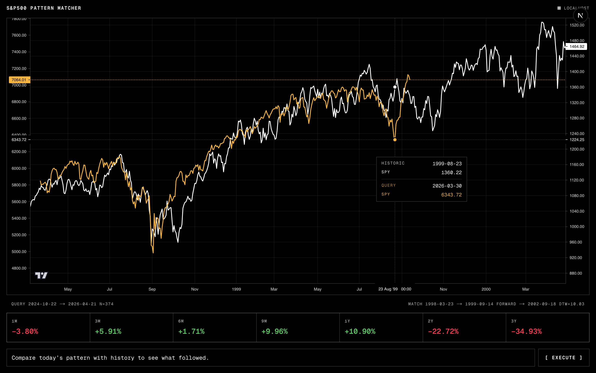
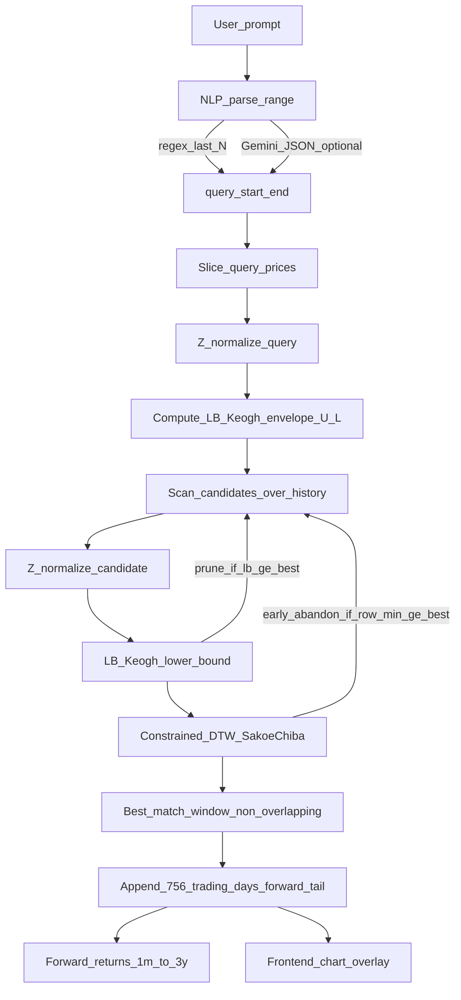

# sp500-pattern-matcher

Finds the **most similar historical window** (by DTW shape similarity) and shows **what happened next**.



## Data

- **Instrument:** S&P 500 index (`^GSPC`)
- **Source:** `yfinance` (`period="max"`)
- **Cache:** `backend/data/sp500.csv`
- **Representation:** in-memory Pandas/NumPy arrays (daily closes)

## Time-series Knowledge

### 1) Z-normalization (shape over level)

We compare windows by **shape**, not absolute price level. For a window $x$,

$$
z_i = \frac{x_i - \mu}{\sigma}
$$

Both the **query** and each **candidate** window are Z-normalized before lower bounding and DTW.

### 2) DTW with a Sakoe–Chiba band + early abandon

DTW aligns two sequences $a$ and $b$ with the classic recurrence:

$$
D[i,j] = (a_i - b_j)^2 + \min(D[i-1,j], D[i,j-1], D[i-1,j-1])
$$

To make scanning feasible over decades of daily data, we constrain the warping path to a **Sakoe–Chiba band**:

- $|i - j| \le r$, where $r = \max(5, \lfloor 0.05n \rfloor)$ and $n$ is the query length.

Implementation notes (matching the code):

- DTW returns a **squared** distance (no final sqrt). This is convenient because LB_Keogh is also a sum of squared deviations.
- **Early abandon:** while filling each DTW row, if the best possible cost for that row is already $\ge$ best-so-far, the candidate is rejected immediately.

### 3) LB_Keogh lower bound (pruning)

LB_Keogh builds an envelope around the query $q$ (after Z-normalization):

- $U_i = \max\bigl(q_{i-r}, \ldots, q_{i+r}\bigr)$
- $L_i = \min\bigl(q_{i-r}, \ldots, q_{i+r}\bigr)$

For a candidate $c$, the lower bound is:

$$
LB(c) = \sum_i
\begin{cases}
(c_i - U_i)^2 & c_i > U_i \\
(L_i - c_i)^2 & c_i < L_i \\
0 & \text{otherwise}
\end{cases}
$$

Key property used for pruning:

- $LB(c) \le DTW(c, q)$ (with the same band), so if $LB(c)$ is already worse than the best distance found so far, we can **skip DTW** entirely.

### 4) Preventing look-ahead leakage (non-overlap)

The matching scan enforces that the **candidate window plus its forward tail** does **not overlap** the query date range. This prevents any accidental use of “future” information when we later plot “what happened next.”

### 5) Forward returns (what happened next)

After the best match is found, we append a fixed forward tail of **756 trading days** (~3 years) and compute returns from the aligned end date $T_0$:

- 21/63/126/189/252/504/756 trading days $\approx$ **1m/3m/6m/9m/1y/2y/3y**

## Run

### Backend (FastAPI)

```bash
cd backend
cp .env.example .env   # optionally set GEMINI_API_KEY=... inside .env
uv sync
uv run uvicorn app.main:app --reload --port 8000
```

If `GEMINI_API_KEY` is missing, the backend still works using:

- the regex fast-path (`last N days|weeks|months|years`), or
- a simple default window.

Health check:

```bash
curl http://localhost:8000/health
```

### Frontend (Next.js)

```bash
cd frontend
pnpm install
pnpm dev
```

Open `http://localhost:3000` and try prompts like:

- `last 2 years`
- `Jan 2025 through now, what happened next historically?`

## API endpoints

- `GET /health` — dataset bounds + row count
- `GET /historic` — full price series for chart context
- `POST /match` — `{ "prompt": "..." }` → best match + forward returns

## Key files (where the course logic lives)

- `backend/app/tsmining.py` — Z-normalization, LB_Keogh envelope/bound, banded DTW
- `backend/app/match.py` — scan + pruning + non-overlap guard + forward-return calculation
- `backend/app/nlp.py` — prompt → date-range parsing (regex + optional Gemini)

## Pipeline


